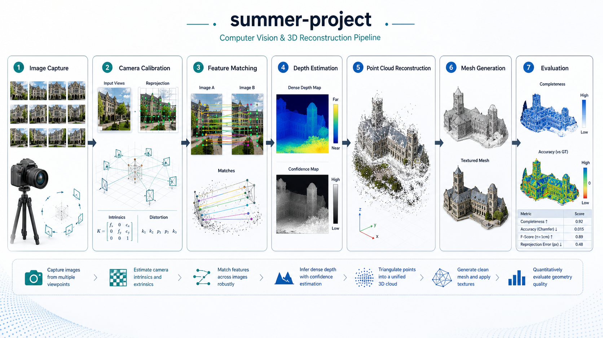

# Summer Project: 3D Reconstruction

    

  <strong>Computer-vision workspace for image capture, reconstruction, and mesh generation.</strong>

  

The overview figure follows the reconstruction path from image capture and calibration through feature matching, depth estimation, point-cloud reconstruction, mesh generation, and evaluation.

## Overview

Summer Project organizes assets for a 3D reconstruction workflow, including VisualSFM, CMVS-PMVS, mesh reconstruction, database artifacts, and project documentation. It is a practical workspace for moving from captured images to point clouds and reconstructed meshes.

## What Is Included

- `visualSFM/`: VisualSFM-related reconstruction assets.
- `CMVS-PMVS/`: dense reconstruction tools and project files.
- `meshrecon/`: mesh reconstruction components.
- `3D construction/`: 3D construction workspace and supporting files.
- `说明文档-分布式移动服务器网络.docx`: project documentation.

## Quick Start

1. `git clone git@github.com:Hik289/summer-project.git`
2. Open the reconstruction tool folder that matches the desired stage: `visualSFM/`, `CMVS-PMVS/`, or `meshrecon/`.
3. Use the project document as the guide for local system settings and data layout.

## Suggested Workflow

1. Start with the smallest runnable script or notebook listed above.
2. Keep raw data paths and credentials outside the repository.
3. Save generated figures, tables, and reports under the existing result folders.
4. When an experiment becomes stable, record the exact data window, parameters, and command used to reproduce it.

## Repository Map

- `assets/readme-figure.png`: README overview figure.
- Project scripts and notebooks: core research entry points.
- Result or report folders: generated artifacts used for analysis and review.

## Paper or Reference

No external paper link is currently attached to this project. For now, the code, notebooks, and notes in this repository are the primary reference artifact.

## License

No explicit license file is included yet. Add one before public reuse, redistribution, or package release.

## Maintenance Notes

- Add a pinned environment file if this project is prepared for external installation.
- Keep large datasets outside Git and document where each script expects them locally.
- Prefer small, named experiment outputs over overwriting shared result files.
